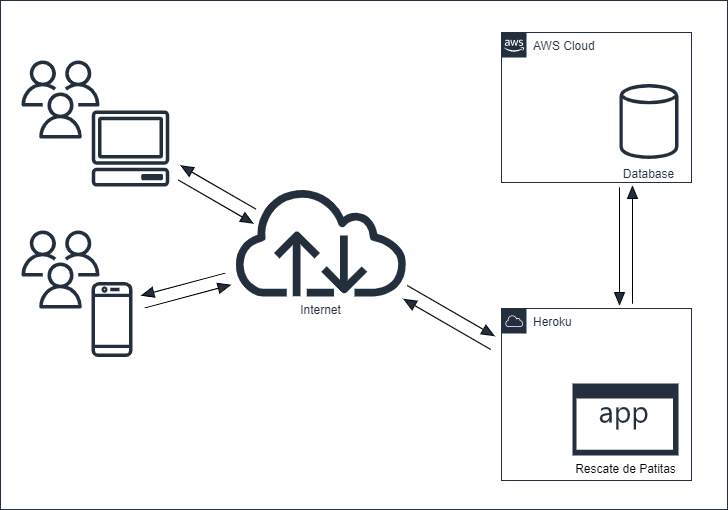

# Entrega VII (2021-12-3): Despliegue

## El Enunciado

El enunciado para esta entrega puede verse en [este docs](https://docs.google.com/document/d/17vHuHa8pGX134T9GQwWgzUgIz7w1R2JW4SFX4JGimJI/edit)

## Requerimientos

1. Se deberá desplegar el sistema en la nube para que pueda ser accedido por el público general.
2. Se debe configurar el proceso que genera las recomendaciones de adopción de mascotas para que corra semanalmente, a un horario determinado del día. ([entrega 3](./03-rp.md))
3. Se debe listar las mascotas de un usuario y luego mostrar el código QR para poder imprimirlo.

## Entregables Requeridos

1. Diagramas de Arquitectura: diagrama de componentes y de despliegue de la solución.

2. Despliegue del Sistema en la nube.

[Rescate de Patitas](https://rescate-de-patitas.herokuapp.com)
