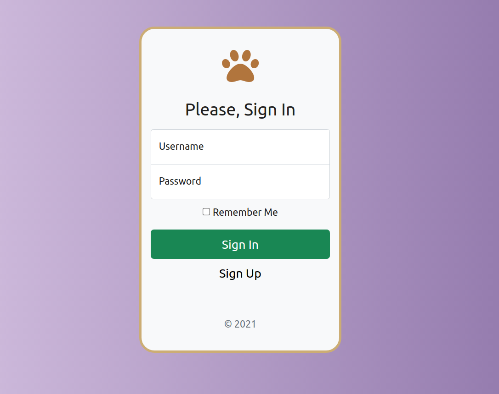
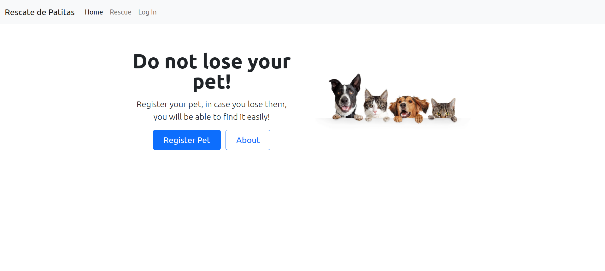
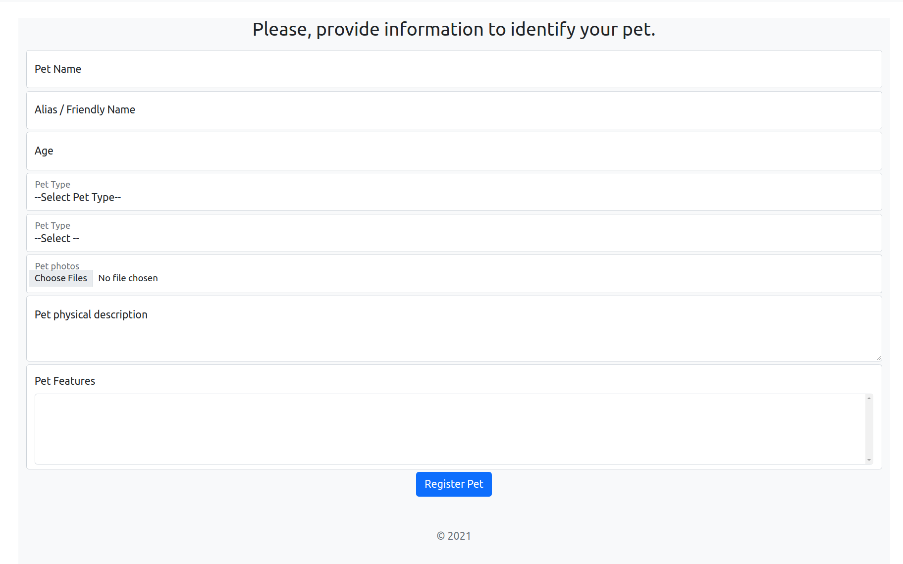
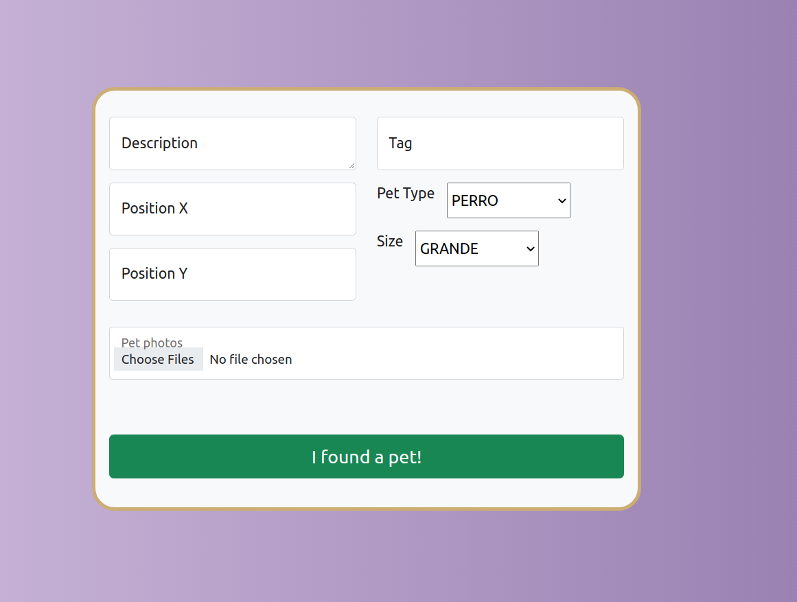
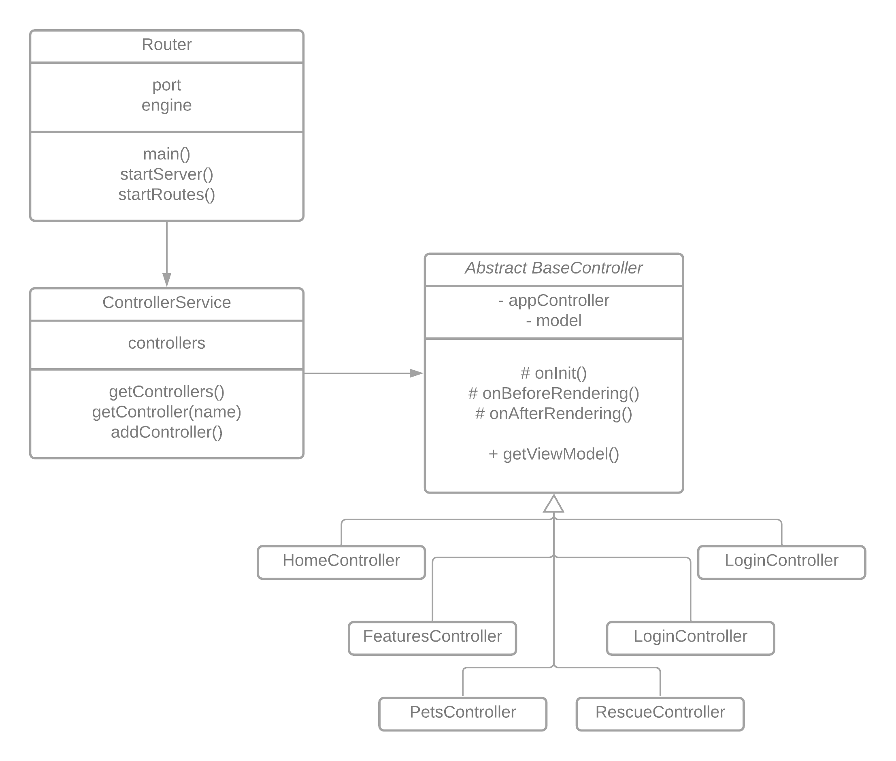

# Rescate de Patitas

## Entrega IV (2021-11-16): Presentación

### Enunciado

El enunciado para esta entrega puede verse en [este docs](https://docs.google.com/document/d/1GLkOBQtSAX2lZmNBML8tmm0xFpEg9uBXp9kQmTzfS9Y/edit)

### Requerimientos

Diseñar, maquetar e implementar:

1. Pantallas que cumplan con la funcionalidad “Quiero registrar a mi mascota”, recordando que se le debe ofrecer la posibilidad de generar un usuario al dueño de la mascota.

2. Pantallas que cumplan con la funcionalidad de “Encontré una mascota perdida", contemplando ambos casos (con chapita y sin chapita), desde la perspectiva de un rescatista.

3. Pantallas para el Administrador que permitan configurar las características de las mascotas.

### Entregables Requeridos

- Wireframe de las Pantallas
- Implementacion en código fuente

### Resolucion

#### Wireframe

##### Login

##### Home

##### Registro de Mascotas

#### Registro de Rescate

#### Implementación

##### Diagrama de Clases

