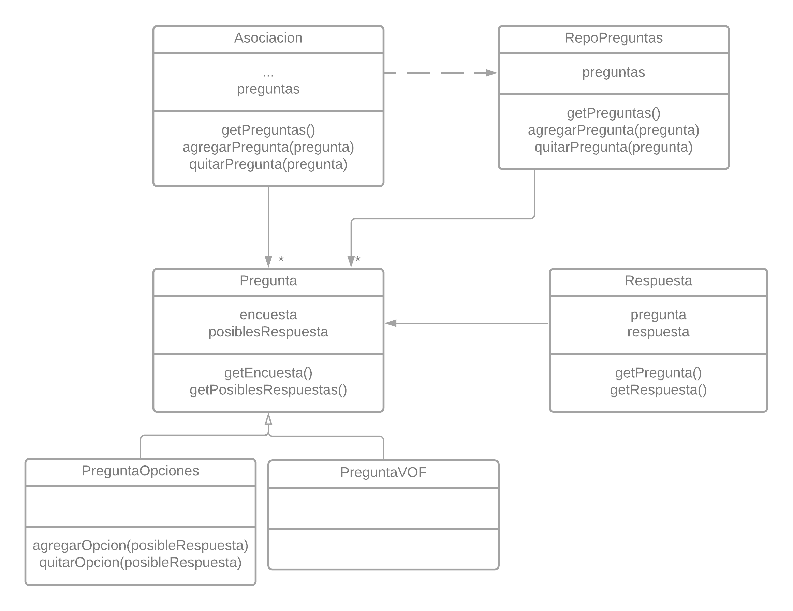

# Rescate de Patitas

## Entrega IV (2021-10-01): Persistencia

### Enunciado

El enunciado para esta entrega puede verse en [este docs](https://docs.google.com/document/d/e/2PACX-1vRvFTDJ2FMiWZR7jHuhYcZatwLPLP5Xj8yEmv17ArmJbW4TNI6arvpi1X7DSmUEcAswwBBB82O0KT2V/pub)

### Requerimientos

1. Se deberán persistir las entidades del modelo planteado. Para ello se debe utilizar un ORM. 

### Entregables Requeridos

> Modelo de objetos: diagrama de clases actualizado según las modificaciones que haya sufrido por  la técnica de mapeo objeto – relacional. 

> Modelo de datos: diagrama de entidad relación físico

> Implementacion

Ver [Changelog](./CHANGELOG.md) de cambios que refieran a _ORM_ y aquellas que involucren _Tests_

> Justificaciones
