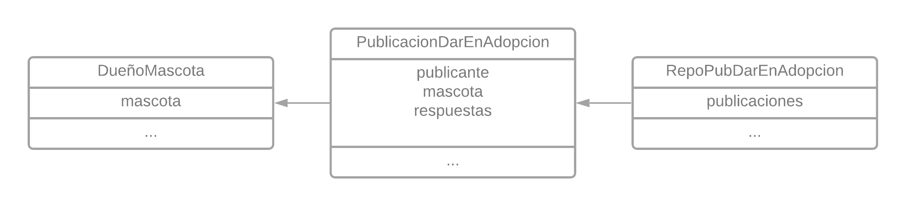

# Rescate de Patitas

## Entrega III (2021-07-02)

### Enunciado

El enunciado para esta entrega puede verse en [este docs](https://docs.google.com/document/d/1VIW_oYMI213rGapRtj3srDHwxm9OXfN9X-826hyXUv4/edit#heading=h.8an72nimoc9j)

### Requerimientos

1. Se debe permitir que una persona genere una publicación para dar en adopción a su mascota.
2. Se debe permitir que cada organización defina las preguntas que le realizará al dueño cuando éste quiera dar en adopción a su mascota. Se debe tener en cuenta que las preguntas podrían llegar a variar en cualquier momento.
3. Se debe enviar una notificación al dueño actual de la mascota cuando aparezca algún interesado en adoptarla.
4. Se debe permitir que una persona genere una publicación que demuestre su intención de adoptar una mascota, teniendo en cuenta sus preferencias y comodidades.
5. Se deben generar y enviar recomendaciones semanales de adopción de mascotas.

### Solución por Requerimientos

> Permitir que una persona genere una publicación para dar en adopción

