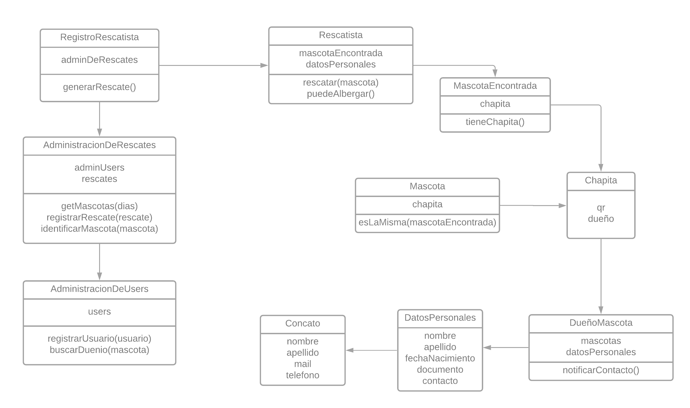
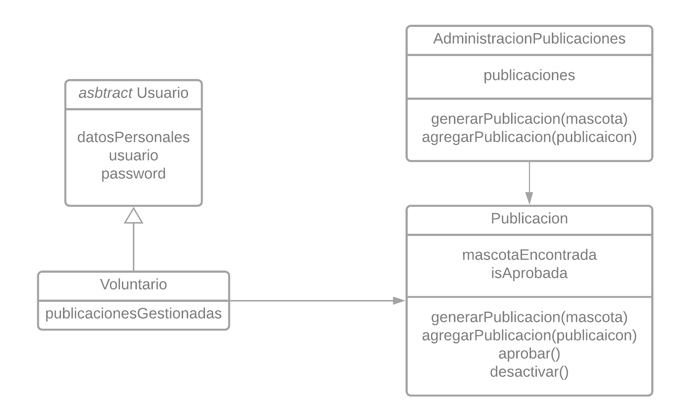
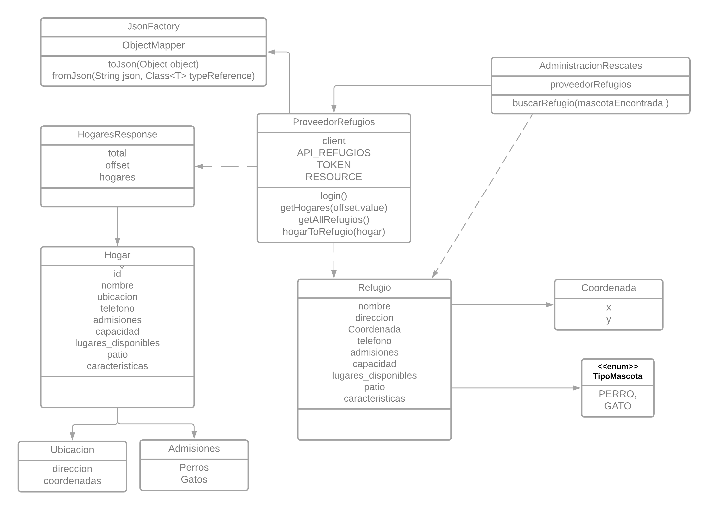
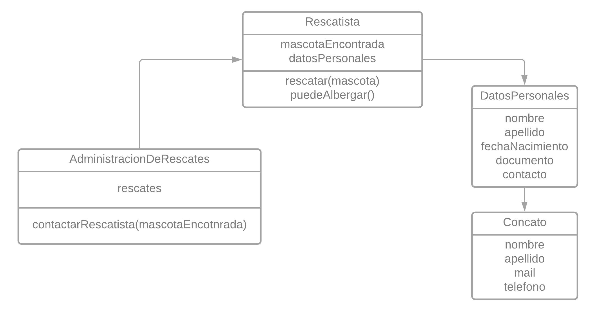

# Rescate de Patitas

## Entrega II (2021-06-04)

### Enunciado

El enunciado para esta entrega puede verse en [este docs](https://docs.google.com/document/d/1FBd9pkQ7Cvy5weS4PzNFnEEHLnmmrJZX4cpGnpuZY9U/edit#)

### Requerimientos

1. Se debe permitir que una persona informe que encontró una mascota perdida (con chapita) y que el sistema le notifique al dueño de esta situación.
2. Se debe permitir que una persona informe que encontró una mascota perdida (sin chapita) y que el sistema genere una publicación.
3. Se debe permitir generar usuarios Voluntarios, los cuales podrán aprobar y gestionar las publicaciones de mascotas perdidas.
4. Se debe permitir que el sistema ofrezca posibles hogares de tránsito a los rescatistas de mascotas. La siguiente API REST ofrece un listado de hogares de tránsito: <https://app.swaggerhub.com/apis-docs/ezequieloscarescobar/hogares-transito-mascotas/1.0-oas3>
5. Se debe permitir que una persona busque a su mascota perdida en la plataforma y que pueda contactarse con el rescatista en caso de encontrarla.

### Solución por Requerimientos

> Permitir que una persona informe que encontró una mascota perdida se notifique al dueño de esta situación.

> Informe de mascota perdida y que el sistema genere una publicación

> Generar usuarios Voluntarios, los cuales podrán aprobar y gestionar las publicaciones

> Ofrecer posibles hogares de tránsito a los rescatistas de mascotas

> Permitir que una persona busque a su mascota perdida en la plataforma y que pueda contactarse con el rescatista

